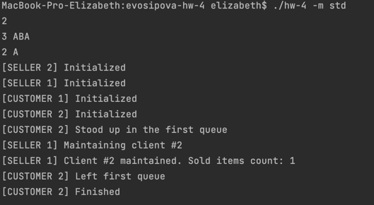
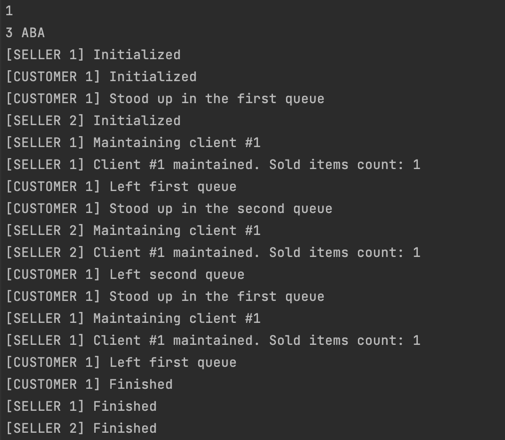
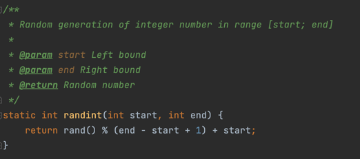
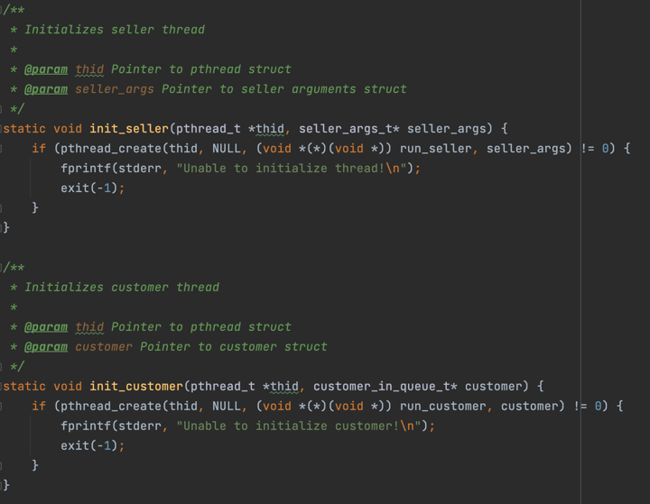
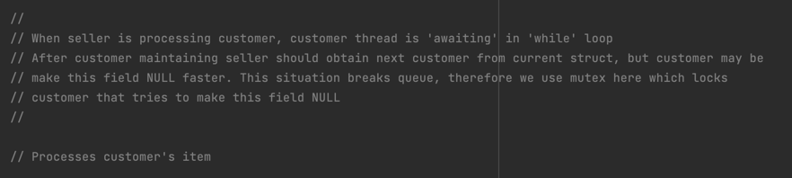
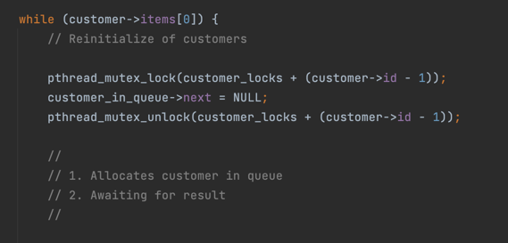
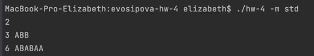
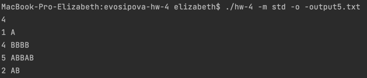

# HW_4
## Осипова Елизавета - БПИ219 - Вариант 19

### Задание - 19 вариант:
<b>Задача о магазине - 2 (забывчивые покупатели).</b> <br>
В магазине работают два отдела, каждый отдел обладает уникальным ассортиментом. В каждом отделе работает один продавец. В магазин ходят исключительно забывчивые покупатели, поэтому каждый покупатель носит с собой список товаров, кото- рые желает купить. Покупатель приобретает товары точно в том порядке, в каком они записаны в его списке. При этом товары в списке расположены в случайном порядке, что заставляет покупателя переходить от отдела к отде- лу, если это требуется для совершения покупок. Продавец может обслужить только одного покупателя за раз. Покупатель, вставший в очередь, засыпает пока не дойдет до продавца. Продавец засыпает, если в его отделе нет поку- пателей, и просыпается, если появится хотя бы один. Создать многопоточное приложение, моделирующее работу магазина в течение рабочего дня.

## Build

`make -j1 all`

## Flags

- `--mode, -m` – set input mode. Available modes: `std, cli, file, random`
- `--in, -i` – set input file instead of `STDIN` for `file` mode
- `--out, -o` – set output file instead of `STDOUT`

> Note: all errors are written in `STDERR` which cannot be overridden

## Modes

- `std` – use default `STDIN` as input. Example of input is given in `input-example.txt`
- `cli` – customers definition are written as program arguments. The example is given below: `./hw-4 -m cli --items AABABBA --items BBBAABB --items AAAAAA --items ABABAB`
- `file` – use file as an input. The input format is the same as for `std`
- `random` – generates a random amount of customers (in range from 2 to 10) with random items lists (the length of each list is in range from 5 to 15). In this mode the information about generated customers included at the beginning of output


### На 8 баллов:

ВАЖНО: Код программы на 8 баллов полностью удовлетворяет критериям на 4-7.

Модель параллельных вычислений, используемая при разработке многопоточной программы: <b>Производители и потребители</b>. 

Производители и потребители – это парадигма взаимодействующих неравноправных потоков. Одни потоки «производят» данные, другие их «потребляют». Часто такие потоки организуются в конвейер, через который проходит информация. Каждый поток конвейера потребляет выход своего предшественника и производит входные данные для своего последователя.


• Реализовано консольное приложение, решающее поставленную задачу с использованием одного варианта синхропримитивов.<br>

• Ввод данных в приложение реализован с консоли. <br>

• В программу добавлены комментарии, поясняющие выполняемые действия и описание используемых переменных.<br>
[main.c](main.c) <br>
[shop](shop) <br>
[customer](customer) <br>
[io](io) <br>
[argument_resolver](argument_resolver) <br>


Входные данные:<br>
2        - (количество отделов n) 
3 ABA    - (количество товаров и сами товары в 1-ом из n отделов)
2 A      - (количество товаров и сами товары во 2-ом из n отделов)

Тест 1:<br>


Тест 2:<br>


### Реализация
1. «В магазине работают два отдела, каждый отдел обладает уникальным ассортиментом». 
В исходном коде программы был реализован метод, который выполняет роль магазина с двумя отделами. 
2. «В каждом отделе работает один продавец». 
Для каждого клиента реализован отдельный поток. С одним отделом единовременно может взаимодействовать только один клиент, что достигается путем применения мьютексов.
3. «В магазин ходят исключительно забывчивые покупатели, поэтому каждый покупатель носит с собой список товаров, которые желает купить». 
Для каждого покупателя, количество которых задается через консоль или файл, создается его персональный список покупок из товаров.

4. «Покупатель приобретает товары точно в том порядке, в каком они записаны в его списке».
   Покупатель в отдельном потоке проходится по всем элементам коллекции списка товаров и делает запросы в нужный отдел и ожидает ответа от продавца нужного отдела, пока тот не ответит, покупатель не пойдёт за другим товаром.
5. Продавец может обслужить только одного покупателя за раз». 
Использован сшаблон «Производители и потребители», реализация которой приходится на очередь. А для того, чтобы обеспечить безопасное получение данных из очереди – использовались мьютексы.
6. «Покупатель, вставший в очередь, засыпает пока не дойдет до продавца». Для реализации данного пункта использовались мьютексы для текущего покупателя отдела

Initializes customer and sellers thread:<br>



• Сценарий, описывающий одновременное поведение представленных в условии задания сущностей в терминах предметной области.
Представлено в виде комментариев в коде:<br>
<br>
<br>


• Реализован ввод данных из командной строки.<br>

```
[SELLER 1] Initialized
[CUSTOMER 2] Initialized
[CUSTOMER 2] Stood up in the first queue
[SELLER 2] Initialized
[CUSTOMER 1] Initialized
[CUSTOMER 1] Stood up in the first queue
[SELLER 1] Maintaining client #2
[SELLER 1] Client #2 maintained. Sold items count: 1
[SELLER 1] Maintaining client #1
[SELLER 1] Client #1 maintained. Sold items count: 1
[CUSTOMER 1] Left first queue
[CUSTOMER 1] Stood up in the second queue
[CUSTOMER 2] Left first queue
[CUSTOMER 2] Stood up in the second queue
[SELLER 2] Maintaining client #1
[SELLER 2] Client #1 maintained. Sold items count: 2
[SELLER 2] Maintaining client #2
[SELLER 2] Client #2 maintained. Sold items count: 1
[CUSTOMER 1] Left second queue
[CUSTOMER 1] Finished
[CUSTOMER 2] Left second queue
[CUSTOMER 2] Stood up in the first queue
[SELLER 1] Maintaining client #2
[SELLER 1] Client #2 maintained. Sold items count: 1
[CUSTOMER 2] Left first queue
[CUSTOMER 2] Stood up in the second queue
[SELLER 2] Maintaining client #2
[SELLER 2] Client #2 maintained. Sold items count: 1
[CUSTOMER 2] Left second queue
[CUSTOMER 2] Stood up in the first queue
[SELLER 1] Maintaining client #2
[SELLER 1] Client #2 maintained. Sold items count: 2
[CUSTOMER 2] Left first queue
[CUSTOMER 2] Finished
[SELLER 1] Finished
[SELLER 2] Finished
```

Вывод в файл:<br>
<br>
[output5.txt](output5.txt) - файл с выходными данными

• В программу добавлены ввод данных из файла и вывод результатов в файл.


Тест 1: <br>
[input1.txt](input1.txt) - файл с входными данными<br>
[output1.txt](output1.txt) - файл с выходными данными 

Тест 2: <br>
[input2.txt](input2.txt) - файл с входными данными<br>
[output6.txt](output6.txt) - файл с выходными данными

• В программу добавлена генерация случайных данных в допустимых диапазонах.


[output2.txt](output2.txt) - тест 1 <br>
[output3.txt](output3.txt) - тест 2 <br>
[output4.txt](output4.txt) - тест 3 <br>


